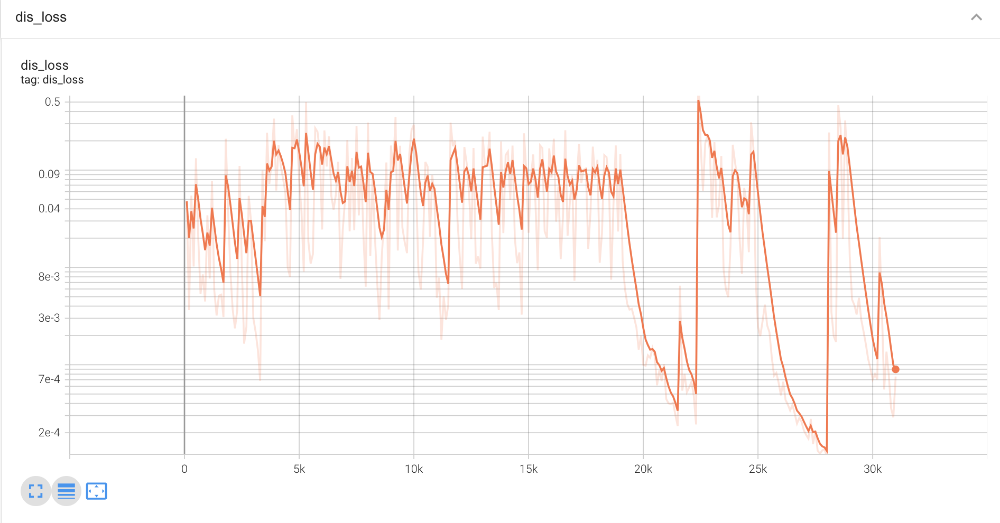
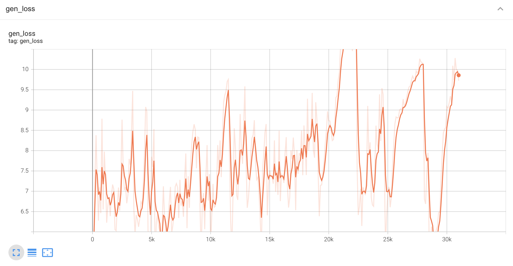
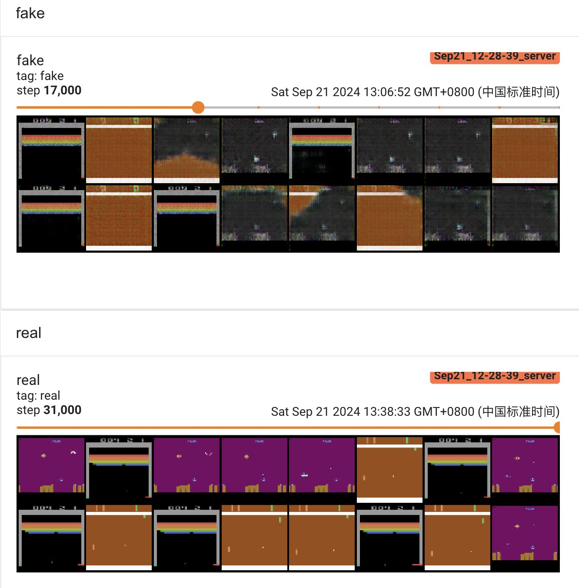
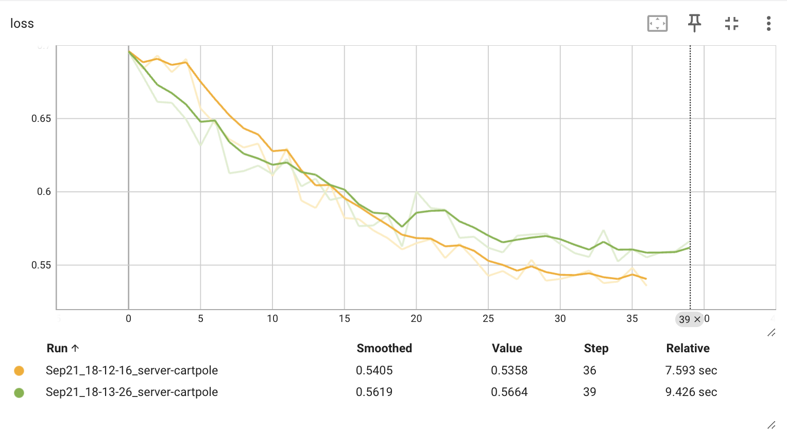
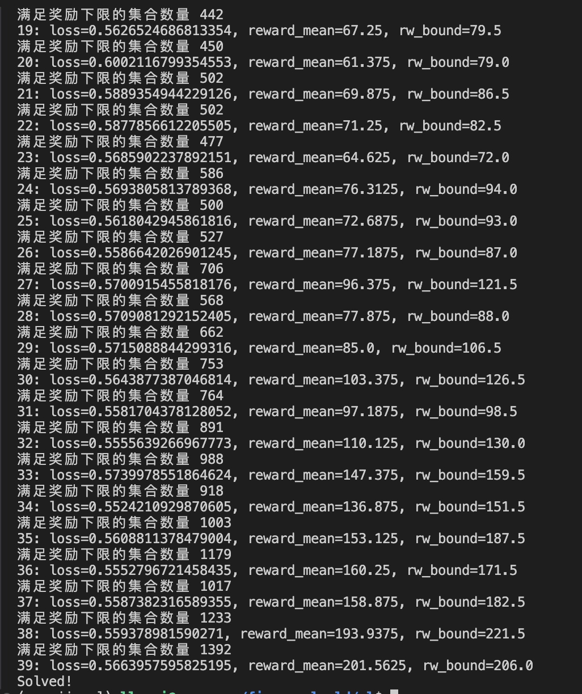

## 创建强化学习环境
conda create --name env_name python=3.11
## 安装环境
```shell
pip install opencv-python
pip install torch==2.4.1 torchaudio==2.4.1 torchvision==0.19.1
pip install tensorboard
pip install tensorboardX
pip install gym
pip install gym[atari]
pip install gym[accept-rom-license]
# 对应numpy修改bool8为bool
```
可直接安装requirements.txt对应环境即可
## 启动tensorboard查看日志
```shell
tensorboard --logdir=runs --port=6007 --host=0.0.0.0
```
## GAN网络效果图
### loss变化


### 生成的虚假图像和真实图像对比

## CartPole小车摆动实验
### loss变化

### 平均奖励和奖励下限的变化
